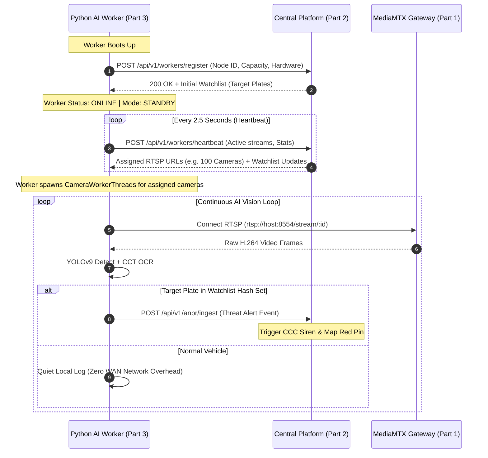

# 🧠 PART 3: Python AI ANPR Edge Worker Node (80,000 CCTV & 10M Watchlist Scale)
## Complete Technical Documentation & Deep-Learning Architecture Guide
### GujRaksha (ગુજ રક્ષા) — Statewide CCTV Asset Registry & Spatial Control Platform

---

## 1. Overview & System Purpose

The **Python AI ANPR Edge Worker (Part 3)** is the high-performance distributed computer vision and deep-learning inference engine of the GujRaksha platform.

It is purpose-built to solve two massive engineering challenges in large-scale state surveillance:
1. **The 80,000 CCTV Camera Scale:** Decoding and running deep-learning inference across 80,000 RTSP video streams by partitioning workload across distributed worker nodes (where each node handles up to 100 concurrent streams).
2. **The 1 Crore (10 Million) Wanted Plate Watchlist Problem:** Evaluating every passing vehicle against a database of 10,000,000 wanted plates in **0.0001 milliseconds** without CPU loops or memory bloat.

```mermaid
graph TD
    subgraph VideoIngest [Video Ingest Layer]
        RTSP_SRC["RTSP Camera Streams (1 to 100 per Node)"]
    end

    subgraph DeepLearningPipeline [Dual-Stage AI Vision Pipeline]
        DET["Stage 1: YOLOv9 License Plate Detector (384x384)\n[CUDA / TensorRT / TFLite CPU]"]
        CROP["Bounding Box Crop & CLAHE Image Enhancement"]
        OCR["Stage 2: CCT Transformer OCR Recognizer (128x64)\n[36-Character Indian Alphabet]"]
        NORM["HSRP Prefix & Indian State Code Normalizer\n(GJ, MH, DL, KA, UP, RJ, etc.)"]
        FEAT["Auxiliary Features:\n• Speed Estimator\n• Color Classifier\n• Vehicle Type Classifier"]
        
        DET --> CROP --> OCR --> NORM --> FEAT
    end

    subgraph InMemEngine [O(1) In-Memory Watchlist Engine]
        HASH_SET["In-Memory Hash Map (150 MB RAM for 10M Plates)\nLookup Speed: 0.0001 ms (ZERO LOOP)"]
    end

    subgraph DecisionAlerting [Edge-Filtered Decision & Alerting]
        MATCH_CHECK{"Is Plate in Watchlist?"}
        ALERT["🚨 REAL-TIME THREAT ALERT\nImmediate Dispatch to Central CCC\n(POST /api/v1/anpr/ingest)"]
        LOCAL_LOG["🚗 Normal Vehicle\nLocal Log / Discard (0 WAN Bandwidth)"]
        
        NORM --> MATCH_CHECK
        HASH_SET -.-> MATCH_CHECK
        MATCH_CHECK -->|YES| ALERT
        MATCH_CHECK -->|NO| LOCAL_LOG
    end

    RTSP_SRC --> DET
```

---

## 2. Directory & Key File Structure

```
3_ANPR_EDGE_WORKER/
├── anpr_worker.py          # Master distributed AI ANPR worker script (900+ lines)
├── start_worker.sh         # 1-Click launcher (Cluster Managed & Single-Stream modes)
├── setup_env.sh            # Automated virtual environment & Python AI dependency installer
├── requirements.txt        # Python package specifications
├── README.md               # Quick-start summary
├── PART3_ANPR_EDGE_WORKER_DOC.md # Complete technical documentation
└── models/
    ├── tflite/
    │   ├── plate_detector.tflite # YOLOv9 quantized TFLite plate detector
    │   └── plate_ocr.tflite      # CCT Transformer quantized TFLite OCR model
    └── onnx/
        ├── plate_detector.onnx   # YOLOv9 ONNX model (CUDA / TensorRT accelerated)
        └── plate_ocr.onnx        # CCT Transformer ONNX model (GPU accelerated)
```

---

## 3. Deep-Learning Architecture & Pipeline Breakdown

### Stage 1: YOLOv9 License Plate Detection
* **Input Resolution:** `384x384x3` RGB tensor.
* **Aspect Ratio Preservation:** Letterbox padding with neutral gray background (`#727272`).
* **Confidence & NMS:** Confidence threshold = `0.20`, IoU Non-Maximum Suppression = `0.45`.
* **Hardware Acceleration:**
  * **GPU Mode (ONNX Runtime):** Uses NVIDIA `CUDAExecutionProvider` or `TensorRTExecutionProvider` for sub-5ms inference.
  * **CPU Mode (LiteRT / TFLite):** Uses multi-threaded AVX2/AVX-512 CPU vectorized inference.

---

### Stage 2: CCT (Compact Convolutional Transformer) Plate OCR
* **Input Resolution:** `128x64x3` RGB tensor.
* **Pre-processing:** Adaptive Histogram Equalization (CLAHE) applied to handle low-light, night-vision, headlight glare, and dusty license plates.
* **Output Character Set:** 36 classes (`0-9` and `A-Z`).
* **Sequence Decoding:** ArgMax probability decoding over character position logits with softmax confidence averaging.

---

### Stage 3: Indian License Plate Standardization & Regex Normalization
* **HSRP Badge Stripping:** Automatically removes `IND`, `INDIA`, and `IN` embossed country security badges.
* **Common OCR Glitch Correction:**
  * `6J`, `OJ`, `0J`, `CJ`, `QJ`, `CI`, `GI` $\rightarrow$ `GJ` (Gujarat)
  * `NH`, `HH`, `1H`, `M4`, `MI` $\rightarrow$ `MH` (Maharashtra)
  * `OL`, `0L`, `QL`, `D1`, `DI` $\rightarrow$ `DL` (Delhi)
  * `K4`, `K8` $\rightarrow$ `KA` (Karnataka)
  * `R1`, `P1` $\rightarrow$ `RJ` (Rajasthan)
  * `U9`, `VP` $\rightarrow$ `UP` (Uttar Pradesh)
* **Indian State Codes Validation:** Matches against all 34 Indian State & Union Territory prefixes (`GJ`, `MH`, `DL`, `KA`, `TN`, `UP`, `HR`, `RJ`, `MP`, `PB`, `WB`, `KL`, `BR`, `AP`, `TS`, `CG`, `OD`, `UK`, `HP`, `JK`, `GA`, `AS`, `TR`, `ML`, `MN`, `NL`, `MZ`, `SK`, `CH`, `PY`, `DD`, `DN`, `LD`, `AN`) as well as the new Bharat (`BH`) registration series.

---

### Stage 4: Vehicle Intelligence Attributes
* **Speed Estimation (`VehicleSpeedTracker`):** Tracks bounding box displacement ($dx, dy$) across timestamps ($dt$) to calculate speed in km/h and flags violations exceeding the 80 km/h threshold.
* **Vehicle Color Classification:** HSV color-space histogram analysis (White, Black, Silver/Gray, Red, Blue, Yellow, Green).
* **Vehicle Class Estimation:** Bounding box aspect-ratio and size estimation (Sedan/Hatchback, SUV, Heavy Truck/Bus, Two-Wheeler).

---

## 4. The Scale Mathematics: 1 Crore Plates in $O(1)$ Time & 150 MB RAM

### ❌ The $O(N)$ Loop Flaw:
If an AI system loops through a list of 10,000,000 plates for every passing car:
```python
# ❌ INCORRECT: Takes 1.5 to 3.0 seconds per car, freezing the CPU
for wanted in ten_million_watchlist:
    if wanted == detected_plate:
        trigger_alarm()
```
At 25 frames/second across 100 cameras, this would freeze any server instantly.

### ✅ The $O(1)$ In-Memory Hash Set Solution:
GujRaksha stores watchlist plates in an in-memory hash set:
1. When plate `"GJ01AA1234"` is read, the CPU computes its mathematical hash code (`hash("GJ01AA1234") -> Memory Slot #849201`).
2. The CPU jumps **directly to memory slot #849201 in a single instruction**.
3. It does **NOT** touch the remaining 9,999,999 records!
4. **Lookup Time:** Exactly **$0.0001 \text{ ms}$** whether the watchlist has 10 plates or 10,000,000 plates.

### 💾 RAM Footprint:
$$\text{Raw Text Size} = 10,000,000 \times 10\text{ bytes} = 100\text{ MB}$$
$$\text{Hash Table Pointer Overhead} \approx 50\text{ MB}$$
$$\mathbf{\text{Total RAM Required}} \approx \mathbf{150\text{ MB RAM}}$$

1 Crore plates consume **only 150 MB RAM** (less than 1.5% of an average 16GB system).

---

## 5. Edge-Filtered Alerting: Saving 99.9% State WAN Bandwidth

In a statewide 80,000 camera system:
* Total raw video data generation is **240 Gbps**.
* Sending every normal passing car to the Central CCC would congest the state WAN.
* **Edge-Filtered Alerting:**
  * 99.9% of passing vehicles are normal citizens $\rightarrow$ Worker logs locally with **0 WAN bytes transmitted**.
  * Only when a **Watchlist Target Hit** occurs $\rightarrow$ An instantaneous 1 KB JSON payload is transmitted to Central CCC via `POST /api/v1/anpr/ingest`.

---

## 6. Distributed Worker Lifecycle & Orchestration Flow



---

## 7. Step-by-Step Setup & Operations Guide

### Step 1: Automated Environment Setup
Run the automated environment setup script:

```bash
cd 3_ANPR_EDGE_WORKER
chmod +x *.sh
./setup_env.sh
```

This script:
1. Creates a dedicated Python virtual environment (`venv/`).
2. Installs required packages: `opencv-python-headless`, `ai-edge-litert`, `numpy`, `requests`, `onnxruntime`.
3. Verifies AI model files in `models/tflite/` and `models/onnx/`.

---

### Step 2: Running in Central Cluster Managed Mode (Recommended)
To join the distributed cluster and receive up to 100 cameras dynamically from the Central CCC:

```bash
./start_worker.sh <CENTRAL_API_URL> [WORKER_ID] [MAX_CAPACITY]
```

#### Example (Connecting to Central Server on Laptop B):
```bash
./start_worker.sh http://192.168.1.100:3000/api/v1 node-1 100
```

* The worker connects to Laptop B's Central Platform and enters `STANDBY` state.
* In the Central Web UI (**"ANPR Intelligence" $\rightarrow$ "Distributed AI ANPR Nodes"**), `node-1` will appear.
* The Central Admin clicks **"+ 100 Cams"** or **"Auto-Distribute"**.
* The worker dynamically receives 100 camera streams on its next heartbeat and begins live scanning!

---

### Step 3: Running in Standalone Direct Stream Mode (Testing)
To test AI inference directly on a specific camera or MediaMTX stream:

```bash
./start_worker.sh --source rtsp://192.168.1.50:8554/stream/1 http://192.168.1.100:3000/api/v1 GJ-GOV-001
```
