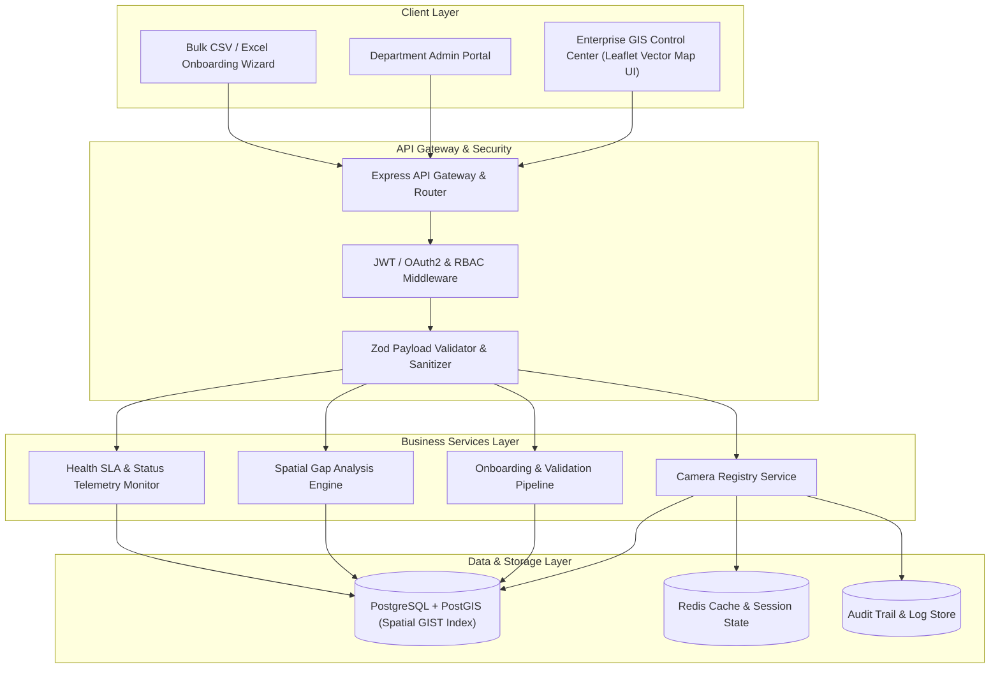

# High-Level System Architecture
## Gujarat Sentinel CCTV Platform — Model 1 & Enterprise Foundation

### Overview
The **Gujarat Sentinel CCTV Platform** is an industrial-grade, multi-tenant CCTV asset registry, GIS mapping, and spatial analytics system designed for the **Gujarat Police Innovation Challenge 2026**.

It addresses the challenge of unifying heterogeneous CCTV infrastructure across 26 government departments and private entities into a single, secure, spatial asset visibility layer.

---

## 1. System Architecture Diagram



---

## 2. Multi-Tier Architectural Components

### A. Data Access & Spatial GIS Engine (PostgreSQL 16 + PostGIS 3.4)
* **Spatial Geography Type**: Uses `GEOGRAPHY(Point, 4326)` for accurate geodesic calculations across Gujarat's ~1,000 km geographic span.
* **Spatial Indexing**: Leverages `GIST` indexing on location coordinates for sub-millisecond bounding box (`ST_MakeEnvelope`) and radial proximity (`ST_DWithin`) queries.
* **Partitioning**: Table partitioning by `department_id` and district code.
* **Credential Encryption**: RTSP/ONVIF passwords encrypted using AES-256-GCM.

### B. Backend REST API Core (Node.js / Express Architecture)
* **Layered Design**: Strict separation between Controllers, Business Services, Repositories, and Data Models.
* **Zod Schema Validation**: Complete runtime validation of input parameters preventing malformed payloads, SQL injections, and XSS.
* **Departmental Isolation & RBAC**: Roles:
  * `STATE_ADMIN`: Full statewide access and configuration rights.
  * `DEPT_ADMIN`: Department-scoped management (e.g., Police, RTO, Food & Civil Supplies).
  * `DISTRICT_OPERATOR`: District-scoped read/write privileges.
  * `AUDITOR`: Read-only access to audit trails and gap reports.

### C. Asynchronous Onboarding & Health SLA Queue
* **Bulk Ingestion Pipeline**: Asynchronous batch processor capable of parsing, validating, and committing 10,000+ camera records per upload batch with error reports.
* **Camera Health Telemetry**: Automated synthetic status ping monitoring camera uptime, connectivity SLA, and maintenance flagging.

### D. Enterprise GIS Frontend Dashboard
* **Leaflet / Mapbox GL JS Vector Rendering**: High-performance spatial cluster rendering handling thousands of markers simultaneously.
* **Multi-Layer Controls**: Instant toggling between 26 government departments and private feeder networks.
* **Spatial Gap Analysis Generator**: Real-time coverage heatmap, unmonitored corridor detection, and equipment lifecycle/ageing alerts.

---

## 3. Database Schema (PostGIS DDL)

```sql
CREATE EXTENSION IF NOT EXISTS postgis;
CREATE EXTENSION IF NOT EXISTS "uuid-ossp";

-- Camera Master Registry
CREATE TABLE IF NOT EXISTS cameras (
    id UUID PRIMARY KEY DEFAULT uuid_generate_v4(),
    camera_code VARCHAR(50) UNIQUE NOT NULL,
    name VARCHAR(255) NOT NULL,
    department_id VARCHAR(50) NOT NULL,
    district VARCHAR(100) NOT NULL,
    taluka VARCHAR(100),
    location GEOGRAPHY(Point, 4326) NOT NULL,
    address TEXT,
    ownership_type VARCHAR(20) CHECK (ownership_type IN ('GOVERNMENT', 'PRIVATE')),
    camera_type VARCHAR(50) CHECK (camera_type IN ('FIXED_BULLET', 'PTZ_360', 'DOME', 'ANPR_SPECIAL')),
    vms_vendor VARCHAR(100),
    stream_url_encrypted TEXT,
    retention_days INT DEFAULT 7,
    status VARCHAR(20) DEFAULT 'ACTIVE' CHECK (status IN ('ACTIVE', 'MAINTENANCE', 'OFFLINE')),
    installation_date DATE,
    created_at TIMESTAMP WITH TIME ZONE DEFAULT CURRENT_TIMESTAMP,
    updated_at TIMESTAMP WITH TIME ZONE DEFAULT CURRENT_TIMESTAMP
);

CREATE INDEX idx_cameras_location ON cameras USING GIST(location);
CREATE INDEX idx_cameras_dept_status ON cameras(department_id, status);
CREATE INDEX idx_cameras_district ON cameras(district);

-- Audit Log Table
CREATE TABLE IF NOT EXISTS camera_audit_logs (
    id UUID PRIMARY KEY DEFAULT uuid_generate_v4(),
    camera_id UUID REFERENCES cameras(id) ON DELETE CASCADE,
    performed_by VARCHAR(100) NOT NULL,
    action_type VARCHAR(50) NOT NULL,
    changes_json JSONB,
    created_at TIMESTAMP WITH TIME ZONE DEFAULT CURRENT_TIMESTAMP
);
```

---

## 4. Scalability Blueprint for 80,000+ Cameras

1. **Database Read Replicas**: Read-heavy GIS map queries routed to PostGIS read-replicas; writes handled by primary instance.
2. **Spatial Vector Tile Caching**: Frequently requested map bounding boxes cached at Redis edge nodes.
3. **Stateless Node.js Services**: Microservices deployed in Kubernetes with Horizontal Pod Autoscalers (HPA) auto-scaling based on CPU/Memory load.
4. **Low Bandwidth Edge Readiness**: Local regional edge nodes aggregate camera metadata and send lightweight status telemetry heartbeats back to central platform.
