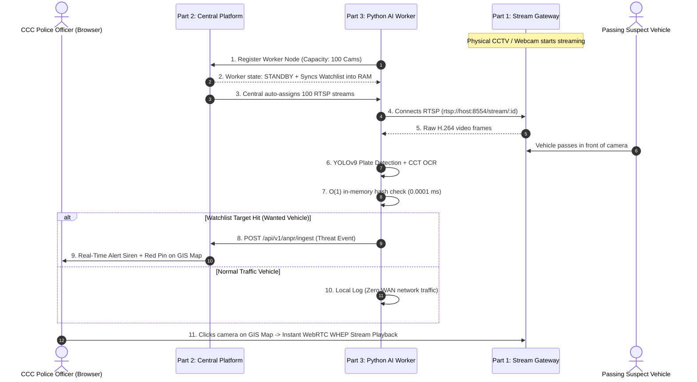

# 🛡️ GujRaksha (ગુજ રક્ષા) — Complete Project Documentation Index

Welcome to the **GujRaksha Sentinel CCTV & ANPR Platform** documentation hub. The project has been architected and divided into **3 independent, modular parts**:

---

## 📚 3-Tier Distributed Architecture Documentation

| Part | Component | Description & Key Tech | Documentation Link |
| :---: | :--- | :--- | :--- |
| **1** | **`1_STREAM_GATEWAY`** | **MediaMTX Standalone Video Stream Server** • Protocol Gateway (RTSP, WebRTC/WHEP, HLS) • Ingests IP Cameras & Webcams | 📄 [PART1_STREAM_GATEWAY_DOC.md](file:///home/dell-i5/nxon-projects/GujRaksha/sentinel-cctv-platform/docs/PART1_STREAM_GATEWAY_DOC.md) |
| **2** | **`2_CENTRAL_PLATFORM`** | **Statewide Central Command & Control Platform** • 80,000+ CCTV Camera GIS Map & Video Wall • Watchlist & Threat Ingestion Engine • AI Worker Cluster Orchestrator | 📄 [PART2_CENTRAL_PLATFORM_DOC.md](file:///home/dell-i5/nxon-projects/GujRaksha/sentinel-cctv-platform/docs/PART2_CENTRAL_PLATFORM_DOC.md) |
| **3** | **`3_ANPR_EDGE_WORKER`** | **Distributed Python AI ANPR Edge Worker Node** • YOLOv9 Plate Detector + CCT Transformer OCR • $O(1)$ In-Memory 10M Watchlist (150 MB RAM) • Edge-Filtered Alerting (99.9% Bandwidth Saving) | 📄 [PART3_ANPR_EDGE_WORKER_DOC.md](file:///home/dell-i5/nxon-projects/GujRaksha/sentinel-cctv-platform/docs/PART3_ANPR_EDGE_WORKER_DOC.md) |

---

## 🌐 End-to-End System Workflow

